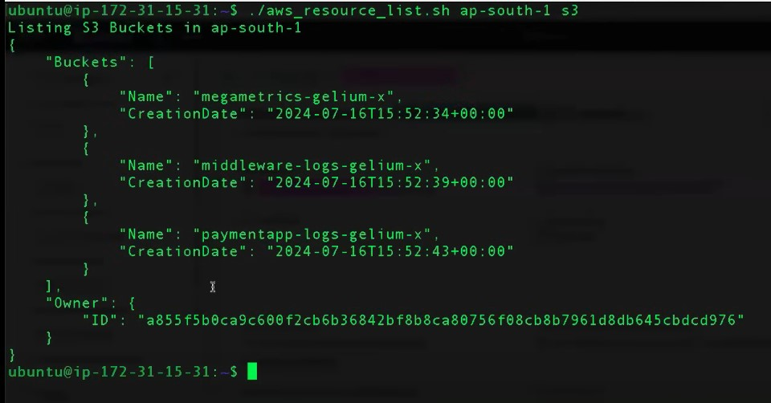
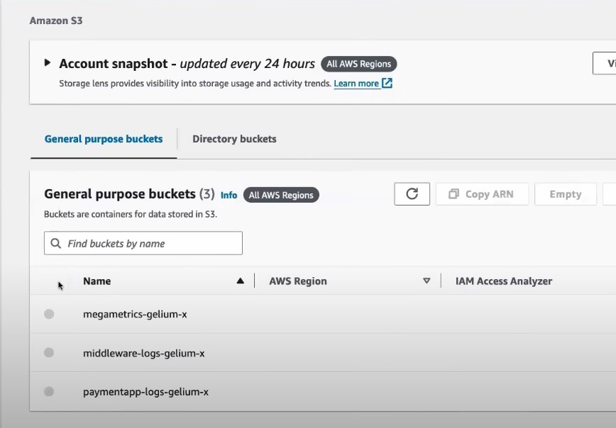

# AWS Resource Lister - Shell Scripting Project
Hey there, This is my little bash baby: `aws_resource_list.sh`. Basically, I got sick of poking around the AWS console just to see what’s running, so I cobbled together this script to spit out a list of resources in an AWS account. Think: EC2 instances, S3 buckets, that kind of jazz. It’s for folks like me—DevOps nerds or wannabes—who want a quick, no-fuss way to see what’s up in their cloud playground. Give it a region and a service, and boom, you get a list of what’s live. Kept it dead simple because, honestly, who has time for nonsense when you’re just trying to figure out what’s eating up your AWS bill?

Picked up the basics from some beginner shell scripting series, and, not gonna lie, kinda proud of how it turned out. It’s practical, actually useful, and not just one of those “hello world” things you throw away after ten minutes.

## What You Need (Don’t Skip This)
Alright, before you go running this bad boy, make sure you’ve got:

- **AWS CLI**: If you don’t have this, go hit up the [AWS docs](https://aws.amazon.com/cli/) and install it, seriously, you’ll need it for almost anything with AWS.
- **AWS Config**: Run `aws configure` and put in your creds (access key, secret key, region, output format). The script talks to AWS through this, so don’t skip.

Pro tip: I slapped in some checks to let you know if you’re missing anything, so it won’t just explode and leave you guessing.

## How To Run It (Easy Mode)
Pop open your terminal and type:

```bash
./aws_resource_list.sh <aws_region> <aws_service>
```

A couple of real-world examples:

- Want to see EC2 instances chilling in `us-east-1`?
  ```bash
  ./aws_resource_list.sh us-east-1 ec2
  ```

- Or maybe all your S3 buckets hanging out in `ap-south-1`?
  ```bash
  ./aws_resource_list.sh ap-south-1 s3
  ```

That’s pretty much it. Region, service, done. No secret handshake required.

## What Can It List? (Surprisingly, Quite a Bit)
Here’s the stuff it knows about:

- EC2 (servers, obviously)
- RDS (databases)
- S3 (buckets)
- CloudFront (distributions)
- VPC (virtual networks)
- IAM (users)
- Route53 (hosted zones)
- CloudWatch (alarms)
- CloudFormation (stacks)
- Lambda (functions)
- SNS (topics)
- SQS (queues)
- DynamoDB (tables)
- EBS (volumes)

Try anything else and, yeah, it’ll tell you to take a hike (but nicely).

## Under the Hood (Nerd Corner)
Alright, peek behind the curtain:

- **Input Check**: If you don’t feed it exactly two arguments, it’ll bark at you and quit. Gotta validate those inputs, or things get messy.
- **AWS CLI Check**: Uses `command -v aws` to check if the CLI’s even there. Learned that trick recently, and now I use it everywhere.
- **Config Check**: Looks for `~/.aws` to make sure you’ve set up your creds. If not, it’ll nag you to run `aws configure`.
- **Service Picker**: Uses a `case` statement (so much cleaner than a pile of `if-else`). I had to dig through AWS CLI docs for all the commands. Worth it, though.

## Some Best Practices I Actually Followed
Not to brag (okay, maybe a little), but I tried to do things right:

- **Comments**: Big block at the top with my name, version, how to use it, all that jazz. No mystery code here.
- **Early Validation**: Check everything up front so you don’t waste time.
- **Efficient Logic**: `case` > `if-else`. Fight me.
- **Good Errors**: If you mess up, it tells you exactly what went wrong and how to fix it. Team player energy.

## Security Stuff (Because Yikes, AWS)
- **File Permissions**: `chmod 711` for just me, or `771` if the team needs in. Keeps randoms from editing my script.
- **No Hardcoded Secrets**: Never, ever, EVER put your AWS keys in the code. It just uses whatever you set up with the CLI, like a normal person.

## Proof of Work
Here’s the script in action! I ran it to list S3 buckets in the `ap-south-1` region, and it worked like a charm. Check out the terminal output and the AWS console to see the match:

- **Terminal Output**:  
  

- **AWS Console Verification**:  
  


## Why I’m Hyped About This
Honestly? This is the first time I mashed together shell scripting and AWS for something I’d actually use. It’s a real-world thing—could help you see where your AWS spend is going, or just let you boss your cloud around without the console. I kept it simple, but it works, and that’s what matters. I’d totally show this off in an interview and say, “Look, I build stuff that’s practical and not a dumpster fire.”

Anyway, thanks for checking it out! Hope it shows I’m not just following tutorials—I’m out here trying to level up for real.
